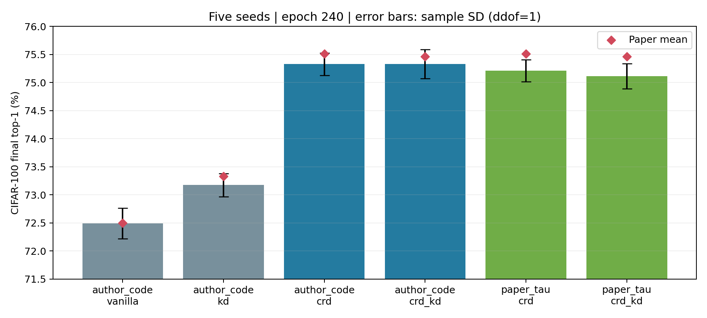

# 最終結果與查核報告

範圍：CIFAR-100，resnet32x4 → resnet8x4。30 runs 全數完成；這不是整篇論文的所有實驗。

所有主要比較取 epoch 240 final；std 使用樣本標準差 ddof=1。作者 seeds 與 std 分母未知。

| Profile | 方法 | mean ± std (%) | 論文差距（百分點） |
|---|---|---:|---:|
| author_code | vanilla | 72.488 ± 0.272 | -0.012 |
| author_code | kd | 73.174 ± 0.206 | -0.156 |
| author_code | crd | 75.328 ± 0.201 | -0.182 |
| author_code | crd_kd | 75.330 ± 0.255 | -0.130 |
| paper_tau | crd | 75.208 ± 0.196 | -0.302 |
| paper_tau | crd_kd | 75.114 ± 0.223 | -0.346 |

## 每次 final 結果

| Profile | 方法 | Seed | Top-1 | Top-5 | Best（僅紀錄） | 訓練與評估時數 |
|---|---|---:|---:|---:|---:|---:|
| author_code | vanilla | 0 | 72.22 | 92.69 | 72.69 | 1.89 |
| author_code | kd | 0 | 72.86 | 92.92 | 73.31 | 2.41 |
| author_code | crd | 0 | 75.05 | 94.13 | 75.55 | 6.32 |
| author_code | crd_kd | 0 | 75.43 | 93.93 | 75.59 | 6.32 |
| author_code | vanilla | 1 | 72.68 | 92.70 | 72.94 | 1.90 |
| author_code | kd | 1 | 73.15 | 92.92 | 73.49 | 2.46 |
| author_code | crd | 1 | 75.56 | 93.88 | 75.56 | 6.31 |
| author_code | crd_kd | 1 | 75.39 | 93.78 | 75.57 | 6.33 |
| author_code | vanilla | 2 | 72.39 | 92.75 | 73.08 | 1.87 |
| author_code | kd | 2 | 73.31 | 92.96 | 73.54 | 2.40 |
| author_code | crd | 2 | 75.25 | 93.75 | 75.44 | 6.26 |
| author_code | crd_kd | 2 | 75.30 | 93.59 | 75.54 | 6.32 |
| author_code | vanilla | 3 | 72.29 | 93.00 | 73.03 | 1.93 |
| author_code | kd | 3 | 73.40 | 92.75 | 73.54 | 2.46 |
| author_code | crd | 3 | 75.48 | 93.60 | 75.67 | 6.24 |
| author_code | crd_kd | 3 | 74.92 | 93.72 | 75.28 | 6.24 |
| author_code | vanilla | 4 | 72.86 | 93.06 | 73.10 | 1.87 |
| author_code | kd | 4 | 73.15 | 92.97 | 73.40 | 2.41 |
| author_code | crd | 4 | 75.30 | 94.00 | 75.67 | 6.25 |
| author_code | crd_kd | 4 | 75.61 | 93.79 | 75.91 | 6.24 |
| paper_tau | crd | 0 | 75.02 | 93.72 | 75.37 | 6.25 |
| paper_tau | crd_kd | 0 | 75.43 | 93.61 | 75.53 | 6.30 |
| paper_tau | crd | 1 | 75.53 | 93.73 | 75.81 | 6.33 |
| paper_tau | crd_kd | 1 | 74.98 | 93.53 | 75.45 | 6.29 |
| paper_tau | crd | 2 | 75.09 | 94.12 | 75.60 | 6.39 |
| paper_tau | crd_kd | 2 | 74.85 | 93.70 | 75.24 | 6.35 |
| paper_tau | crd | 3 | 75.18 | 93.92 | 75.48 | 6.32 |
| paper_tau | crd_kd | 3 | 75.09 | 93.81 | 75.27 | 6.33 |
| paper_tau | crd | 4 | 75.22 | 93.89 | 75.60 | 6.33 |
| paper_tau | crd_kd | 4 | 75.22 | 93.71 | 75.39 | 6.34 |

## 解讀與限制

- author_code 的 CRD 比 vanilla 高 2.840 個百分點，比 KD 高 2.154；主要蒸餾收益得到支持。
- author_code CRD+KD 比 CRD 僅高 0.002 個百分點，不能解讀為明確勝出。論文中略低也不是需要修正的錯誤。
- paper_tau 相對 author_code：CRD −0.120、CRD+KD −0.216 個百分點。只是一個模型配對、五個 seeds 的受控結果，不能推出普遍最佳 temperature。
- 兩種 temperature 分開報告，沒有挑較高者充當作者原始設定。
- 本機曾兩次非預期關機，另一次使用者要求重開機；CRD author_code seed3、paper_tau CRD+KD seed1/seed4 由完整 epoch checkpoint 接續。保留 events 與 console logs。
- resume 驗證涵蓋程式碼、config、環境、教師 checksum，恢復 optimizer、heads、memory/Z 與 RNG；不聲稱任意 batch 或跨硬體 bitwise 等價。
- seconds 只含已提交 epochs 的訓練及評估，不含停機、被丟棄的半個 epoch、存檔與啟動時間。
- 官方 test split 被原碼稱為 val；此處沒有另設 validation split，也未依 test 調參。
- ImageNet、跨模態、ensemble、表徵遷移及完整 benchmark 不在此次完成範圍。

查核明細：[final-audit.json](final-audit.json)。原始逐 epoch 曲線在各 runs/*/curves.png。
